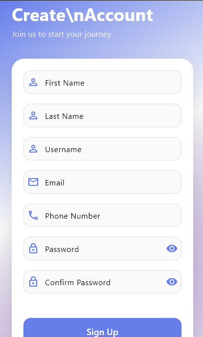

# 🧹 Jisort - Smart Cleaning Task Management

**Jisort** is a powerful Flutter-based cleaning service management application that streamlines task assignment, tracking, and collaboration between managers and cleaning staff. Built with modern architecture and seamless API integration, it transforms how cleaning services operate.

## ✨ Key Features

🔐 **Secure Authentication**
- Email/username login with Laravel Sanctum
- User registration and password recovery
- Role-based access control

📋 **Advanced Task Management**
- Create, edit, and delete cleaning tasks
- Set priorities and due dates
- Track detailed activities within each task
- Real-time progress monitoring

👥 **Staff Assignment & Collaboration**
- Assign tasks to multiple cleaning staff
- Manage team member profiles
- View individual and team workloads
- Activity logging and completion tracking

🎨 **Modern User Experience**
- Beautiful Material Design interface
- Light and dark theme support
- Responsive design for all devices
- Intuitive navigation and workflows

⚡ **Robust State Management**
- Powered by Riverpod for efficient state handling
- Real-time updates across the application
- Optimized performance and memory usage

## 🚀 Quick Start

### Prerequisites

Ensure you have the following installed:
- **Flutter SDK**: 3.0.0 or higher
- **Dart**: 2.17.0 or higher
- **PHP**: 8.0+ (for Laravel backend)
- **MySQL** or **PostgreSQL**
- **Composer** (PHP dependency manager)

### 1. Clone the Repository

```bash
git clone https://github.com/Ochiengjeck/jisort.git
cd jisort
```

### 2. Install Dependencies

```bash
flutter pub get
```

### 3. Environment Configuration

Create a `.env` file in the project root:

```env
BASE_URL=http://127.0.0.1:8000
```

*Replace with your Laravel backend URL for production deployments.*

### 4. Backend Setup

Set up your Laravel backend with the following database configuration:

```env
DB_CONNECTION=mysql
DB_HOST=127.0.0.1
DB_PORT=3306
DB_DATABASE=jisort_db
DB_USERNAME=root
DB_PASSWORD=your_password

SANCTUM_STATEFUL_DOMAINS=localhost,127.0.0.1:8000
```

Run migrations and start the server:

```bash
php artisan migrate
php artisan serve
```

### 5. Launch the App

```bash
flutter run
```

## 📸 Screenshots:

### Authentication & Onboarding
<table>
  <tr>
    <td align="center">
      
      <br/>
      <strong>Login Screen</strong>
      <br/>
      <em>Secure authentication with email/password</em>
    </td>
    <td align="center">
      
      <br/>
      <strong>Sign Up Screen</strong>
      <br/>
      <em>Quick registration for new users</em>
    </td>
    <td align="center">
      
      <br/>
      <strong>Password Reset</strong>
      <br/>
      <em>Easy password recovery process</em>
    </td>
  </tr>
</table>

### Task Management
<table>
  <tr>
    <td align="center">
      
      <br/>
      <strong>All Tasks</strong>
      <br/>
      <em>View all created tasks</em>
    </td>
    <td align="center">
      
      <br/>
      <strong>My Tasks</strong>
      <br/>
      <em>Personal task dashboard</em>
    </td>
    <td align="center">
      
      <br/>
      <strong>Add Task</strong>
      <br/>
      <em>Create new tasks</em>
    </td>
  </tr>
  <tr>
    <td align="center">
      
      <br/>
      <strong>Due Date Selection</strong>
      <br/>
      <em>Built-in date picker for scheduling</em>
    </td>
    <td align="center">
      
      <br/>
      <strong>Task Details</strong>
      <br/>
      <em>View complete task information</em>
    </td>
    <td align="center">
      
      <br/>
      <strong>Edit Task</strong>
      <br/>
      <em>Modify existing tasks</em>
    </td>
  </tr>
  <tr>
    <td align="center">
      
      <br/>
      <strong>Add Staff</strong>
      <br/>
      <em>Register new staff members</em>
    </td>
    <td align="center">
      
      <br/>
      <strong>Assign Task</strong>
      <br/>
      <em>Delegate tasks to assistants</em>
    </td>
    <td align="center">
      
      <br/>
      <strong>Add Activity</strong>
      <br/>
      <em>Log task progress updates</em>
    </td>
  </tr>
</table>

### Backend Activities
<table>
  <tr>
    <td align="center">
      
      <br/>
      <strong>Server Started</strong>
      <br/>
      <em>Backend service initialization</em>
    </td>
    <td align="center">
      
      <br/>
      <strong>Database Set</strong>
      <br/>
      <em>Database connection established</em>
    </td>
    <td align="center">
      
      <br/>
      <strong>Tasks Table</strong>
      <br/>
      <em>Database structure for tasks</em>
    </td>
  </tr>
  <tr>
    <td align="center">
      
      <br/>
      <strong>Create Task</strong>
      <br/>
      <em>Task creation endpoint</em>
    </td>
    <td align="center">
      
      <br/>
      <strong>Fetch Tasks</strong>
      <br/>
      <em>Task retrieval endpoint</em>
    </td>
    <td align="center">
      
      <br/>
      <strong>Database Update</strong>
      <br/>
      <em>Real-time data synchronization</em>
    </td>
  </tr>
</table>

> **Note**: To add screenshots to your repository, create a `screenshots/` folder in your project root and add the corresponding PNG/JPG files with the names referenced above.
## 📱 User Journey

### Authentication Flow
- **Login Screen**: Secure access with email/username and password
- **Registration**: Quick signup process for new users  
- **Password Recovery**: Easy password reset functionality

### Task Management Workflow
- **Task Creation**: Intuitive form with title, description, priority, and due date
- **Activity Management**: Break down tasks into specific cleaning activities
- **Assignment System**: Assign tasks to available cleaning staff
- **Progress Tracking**: Visual progress bars and completion status

### Staff Management
- **Team Overview**: View all cleaning staff and their current assignments
- **Add New Staff**: Simple process to onboard new team members  
- **Workload Distribution**: Balanced task assignment across the team

## 🏗️ Architecture

```
jisort/
├── lib/
│   ├── models/
│   │   ├── task.dart           # Task and Activity data models
│   │   └── user.dart           # User model and authentication
│   ├── providers/
│   │   ├── task_notifier.dart  # Task state management
│   │   ├── user_notifier.dart  # User authentication state
│   │   ├── theme_notifier.dart # Theme switching logic
│   │   └── providers.dart      # Riverpod provider exports
│   ├── services/
│   │   └── api_service.dart    # Laravel API integration
│   ├── screens/
│   │   ├── task_list_page.dart     # Main dashboard
│   │   ├── task_create_page.dart   # Task creation form
│   │   ├── task_details_page.dart  # Task details and editing
│   │   └── assign_users_page.dart  # Staff assignment
│   └── main.dart
├── assets/
└── .env                        # Environment configuration
```

## 🔧 Core Dependencies

```yaml
dependencies:
  flutter_riverpod: ^2.3.6    # State management
  flutter_dotenv: ^5.1.0      # Environment variables
  shared_preferences: ^2.2.0   # Local storage
  http: ^1.1.0                 # API communication
  uuid: ^4.5.1                 # Unique identifiers
```

## 🌐 API Integration

The app communicates with a Laravel backend through RESTful APIs:

**Authentication Endpoints:**
- `POST /api/login` - User authentication
- `POST /api/register` - User registration  
- `POST /api/password/reset` - Password recovery

**Task Management:**
- `GET /api/tasks` - Retrieve all tasks
- `POST /api/tasks` - Create new task
- `PUT /api/tasks/{id}` - Update task
- `DELETE /api/tasks/{id}` - Delete task

**Staff Management:**
- `GET /api/users` - Get available staff
- `POST /api/users` - Add new staff member
- `POST /api/tasks/{id}/assign` - Assign staff to task

## 🤝 Contributing

We welcome contributions! Here's how you can help:

1. **Fork** the repository
2. **Create** a feature branch (`git checkout -b feature/amazing-feature`)
3. **Commit** your changes (`git commit -m 'Add amazing feature'`)
4. **Push** to the branch (`git push origin feature/amazing-feature`)
5. **Open** a Pull Request

## 📄 License

This project is licensed under the MIT License - see the [LICENSE](LICENSE) file for details.

## 🆘 Support

Having issues? We're here to help!

- 📧 **Email**: [ochiengjeck@gmail.com](mailto:ochiengjeck@gmail.com)
- 🐛 **Issues**: [GitHub Issues](https://github.com/Ochiengjeck/jisort/issues)
- 💬 **Discussions**: [GitHub Discussions](https://github.com/Ochiengjeck/jisort/discussions)

## 🌟 Show Your Support

If you find Jisort helpful, please consider:
- ⭐ Starring the repository
- 🐛 Reporting bugs
- 💡 Suggesting new features
- 🤝 Contributing to the codebase

---

**Built with ❤️ using Flutter and Laravel**